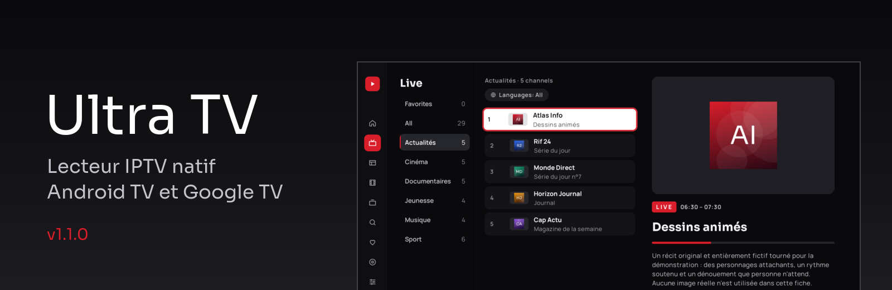
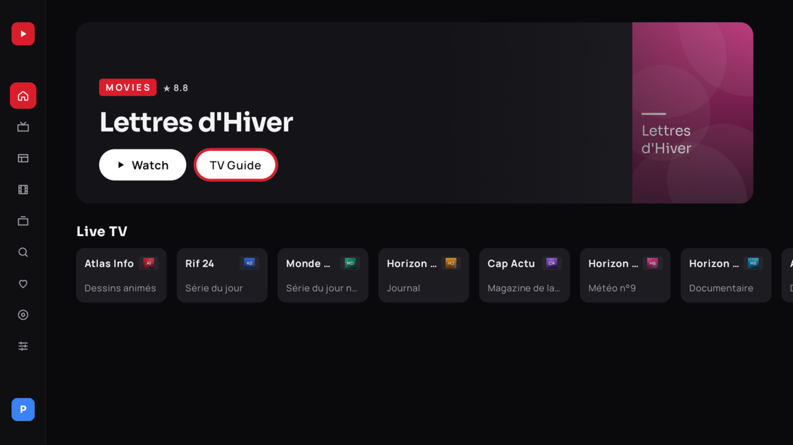
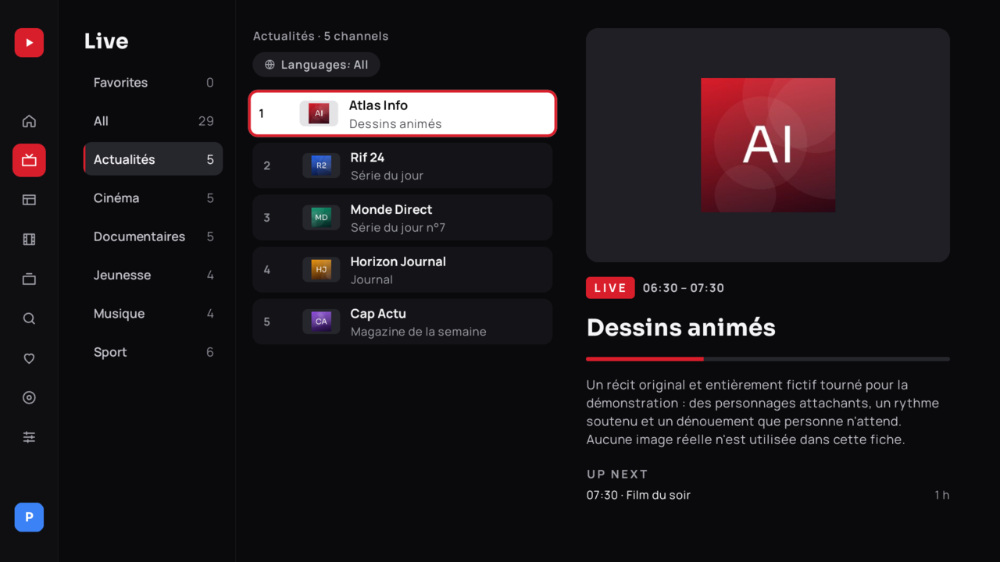
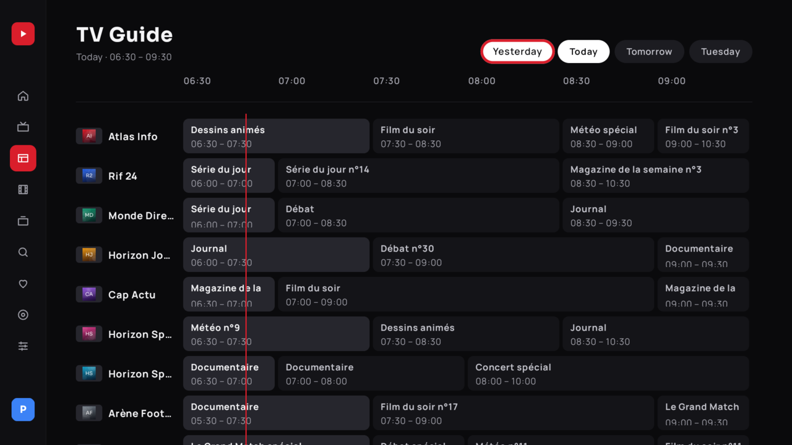
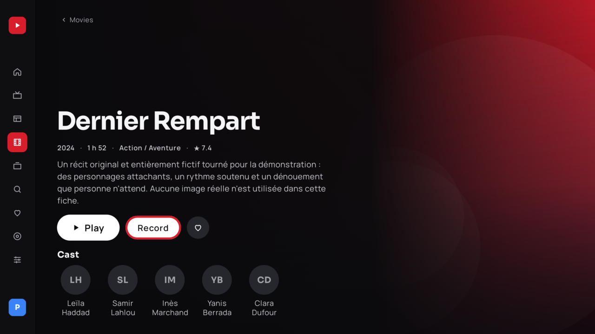
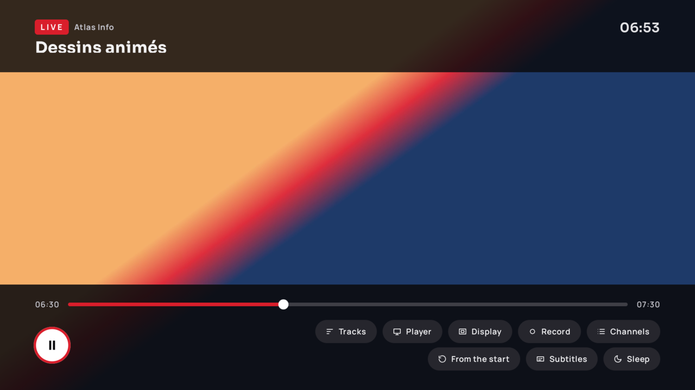
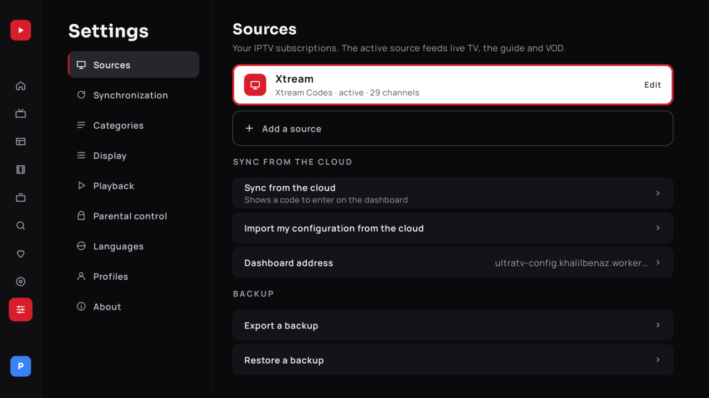
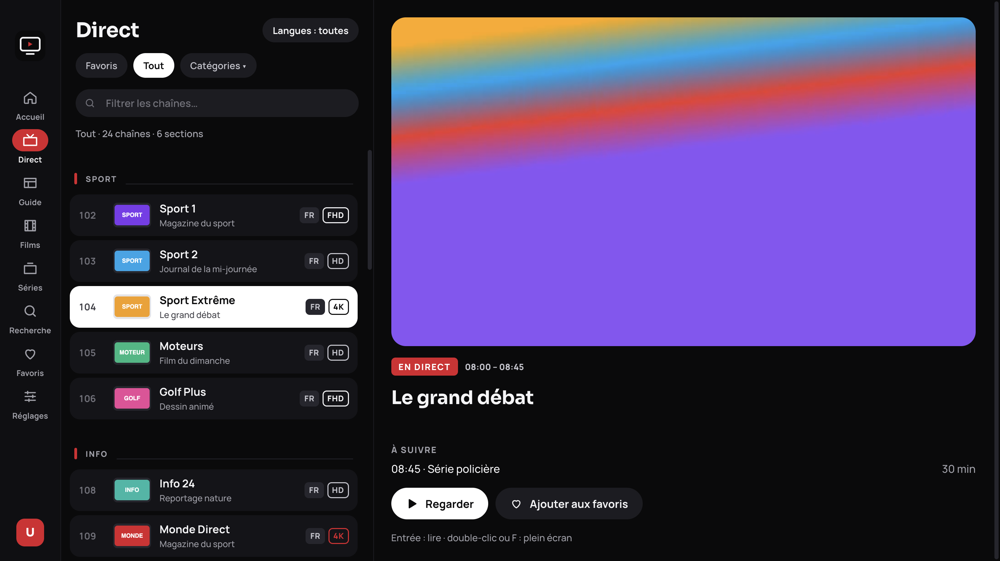

<p align="center">
  
</p>

<h1 align="center">Ultra TV</h1>

<p align="center">
  <strong>Lecteur IPTV natif pour Android TV et Google TV.</strong><br/>
  Kotlin · Compose for TV · Media3 (ExoPlayer) + LibVLC · Room · Hilt
</p>

<p align="center">
  <a href="https://github.com/khalilbenaz/ultra-tv/actions/workflows/ci.yml"></a>
  <a href="https://github.com/khalilbenaz/ultra-tv/releases/latest"></a>
  <a href="LICENSE"></a>
  <a href="https://khalilbenaz.github.io/ultra-tv/"></a>
</p>

<p align="center">
  <a href="https://khalilbenaz.github.io/ultra-tv/">Site</a> ·
  <a href="https://github.com/khalilbenaz/ultra-tv/releases/latest/download/UltraTV-debug.apk">Télécharger l'APK</a> ·
  <a href="https://github.com/khalilbenaz/ultra-tv/releases">Releases</a> ·
  <a href="CHANGELOG.md">Changelog</a>
</p>

---

Ultra TV lit vos propres abonnements IPTV (**Xtream Codes**, **M3U / M3U8** en lien ou en fichier, **Stalker**). Toute l'interface est native et pilotée à la télécommande ; le catalogue (chaînes, films, séries, guide, historique, favoris) vit dans une base Room locale. Il ne fournit **aucun contenu**.

> Les captures ci-dessous utilisent exclusivement des **données synthétiques** (faux serveur Xtream local, `android-native/tools/fake-xtream`).

<p align="center">
  
  
  
  
  
  
</p>

## Fonctionnalités

- **Direct** : catégories actives, filtre par langue dès la première source, séparateurs en en-têtes, badges de qualité, zapping par numéro, retour à la chaîne précédente, 20 chaînes récentes, recherche instantanée (FTS).
- **Guide** : grille horaire, rappels, enregistrements programmés, **replay** (catch-up Xtream) depuis le guide quand la source le permet.
- **Pause du direct** (timeshift) : tampon disque circulaire pour les flux MPEG-TS.
- **Films et séries** : fiches enrichies via **TMDB** (affiche, synopsis, distribution), reprise de lecture, saisons en onglets.
- **Deux moteurs de lecture** : ExoPlayer (Media3) et **LibVLC**, choix Auto / ExoPlayer / VLC, décodage Auto / Matériel / Logiciel, repli automatique et mémorisation par chaîne.
- **Sous-titres** : recherche en ligne (OpenSubtitles via le Worker), style avancé (taille, couleur, fond, contour, position, décalage).
- **Profils** : « Qui regarde ? », profil Enfants, favoris, historique et langues par profil.
- **Google TV** : Watch Next, chaîne Favoris, recherche vocale et globale, liens profonds `ultratv://`.
- **Thèmes** Sombre / Clair / Automatique (le lecteur reste toujours sombre) ; interface en anglais, français, espagnol et arabe (RTL).
- **Veille** : minuterie 30 / 60 / 90 min ou fin de programme ; mise à jour intégrée depuis les releases GitHub.

## Application de bureau (macOS et Windows)

Le même design que l'application Android TV, pour Windows et macOS : l'application web de
[`web/`](web/README.md) empaquetée par Electron ([`electron/`](electron/README.md)). Elle reste
utilisable dans un navigateur. Xtream Codes et M3U (lien ou fichier) ; le catalogue est gardé
en local (IndexedDB), les identifiants sont chiffrés avec le trousseau du système, la lecture
est directe (aucun proxy distant) et la mise à jour est automatique via les Releases GitHub.



Les captures (données synthétiques, FR et EN) sont dans [`docs/screenshots/desktop/`](docs/screenshots/desktop/).
Publication : pousser un tag `desktop-vX.Y.Z` (workflow `desktop-release.yml`, séparé des tags Android `v*`).

## Installation

Android 9 ou plus récent (API 28).

**APK.** Téléchargez [`UltraTV-debug.apk`](https://github.com/khalilbenaz/ultra-tv/releases/latest/download/UltraTV-debug.apk) (somme SHA-256 sur la page de la release) et installez-le.

**Downloader** (box sans navigateur) : ouvrez l'application [Downloader](https://www.aftvnews.com/downloader/), saisissez le code **`5248504`**, autorisez les sources inconnues, installez.

**adb** :

```bash
adb connect IP_DE_LA_BOX:5555
adb install -r UltraTV-debug.apk
```

Au premier lancement : choisissez le type de source, saisissez-la, puis cochez vos langues (seules les catégories correspondantes sont téléchargées).

### Appairage cloud par code

Pour ne pas saisir d'identifiants à la télécommande : Réglages › Sources › **Synchroniser depuis le cloud**. La télévision affiche un code ; saisissez-le dans le tableau de bord de votre [Worker](#worker-cloudflare), ajoutez vos sources, puis « Importer ma configuration depuis le cloud ». L'appareil reçoit un jeton aléatoire de 256 bits (haché côté serveur, chiffré dans le Keystore sur l'appareil, révocable). L'adresse MAC n'est qu'une étiquette, jamais une clé.

## Sécurité

- Identifiants des sources **chiffrés au repos** sur l'appareil ; sur le Worker, AES-256-GCM.
- **Aucune URL de flux, aucun identifiant n'est affiché** ni journalisé ; les messages d'erreur sont filtrés (`UserText`). Un nom de source vide ne reprend pas l'adresse du serveur.
- Aucun jeton partagé dans l'APK. Détails, modèle de menace et rotation des anciens secrets : [SECURITY.md](SECURITY.md).

## Réglages automatiques

À la première ouverture, l'**`AdaptiveProfile`** mesure l'appareil (mémoire, tas, micro-benchmark) et le classe **Bas / Moyen / Haut**. Il en déduit tampon, parallélisme et taille des lots de synchro, plafond de résolution et de débit (box à peu de mémoire : 720p / 6 Mb/s) et ajuste le tampon si des coupures surviennent. Tout reste modifiable : Réglages › Lecture (moteur, décodage, préréglage de tampon : Faible latence, Auto, Équilibré, Stable, Personnalisé).

## Développement

JDK 17 requis.

```bash
git clone https://github.com/khalilbenaz/ultra-tv && cd ultra-tv/android-native
export JAVA_HOME=$(/usr/libexec/java_home -v 17)   # macOS
./gradlew assembleDebug                            # APK universel
./gradlew testDebugUnitTest                        # tests unitaires (JUnit, Robolectric)
./gradlew assembleRelease                          # APK par ABI (arm64-v8a, armeabi-v7a, x86_64)
```

- La version vient du fichier [`VERSION`](VERSION) ; `versionCode = major×10000 + minor×100 + patch` (1.1.0 → 10100).
- **Faux serveur Xtream** pour tester sans abonnement : `python3 android-native/tools/fake-xtream/server.py` (l'émulateur y accède via `http://10.0.2.2:8099`, identifiants `test` / `test`).
- Build debug : intents de débogage (`debug_route`, `debug_theme`, `debug_engine`, `debug_decoder`, `debug_buffer`…) pour les captures et les mesures.
- **CI** ([ci.yml](.github/workflows/ci.yml)) : web (tsc + vitest), Android (compilation + tests unitaires), Worker. Publication : [release.yml](.github/workflows/release.yml) sur tag `v*` ; site : [pages.yml](.github/workflows/pages.yml).

## Worker Cloudflare

`cloudflare-config/` : tableau de bord d'appairage, stockage chiffré des sources, ingestion des crashs, proxies TMDB et OpenSubtitles. Procédure complète : [cloudflare-config/README.md](cloudflare-config/README.md).

```bash
cd cloudflare-config && npm ci
wrangler kv namespace create CONFIG                # coller les ids dans wrangler.toml
wrangler secret put SESSION_SECRET                 # >= 32 caractères aléatoires
wrangler secret put PROVIDER_ENC_KEY               # clé AES-256 en base64
wrangler secret put OPS_TOKEN                      # mot de passe de /crashes et /logs
wrangler secret put TMDB_READ_TOKEN                # jeton de lecture TMDB v4 (fiches enrichies)
wrangler secret put TMDB_API_KEY                   # clé TMDB v3 (repli si pas de jeton v4)
wrangler secret put OPENSUBTITLES_API_KEY          # clé OpenSubtitles (sous-titres en ligne)
npm test && wrangler deploy --dry-run
```

TMDB et OpenSubtitles sont facultatifs : sans leurs secrets, l'application masque les fonctions correspondantes. Pour un fork, compilez avec `-PULTRA_WORKER_URL=https://votre-worker.workers.dev`.

## Limites connues

- Le **replay** et la **pause du direct** dépendent de la source (catch-up Xtream, flux MPEG-TS) ; indisponibles sinon.
- Les fiches TMDB et les sous-titres en ligne exigent un Worker configuré avec les secrets ci-dessus.
- La première synchro d'un très gros catalogue (≈ 55 000 chaînes) prend environ une minute sur un appareil de milieu de gamme et davantage sur un modèle d'entrée de gamme.
- L'APK grossit avec LibVLC (≈ 53 Mo en arm64-v8a, contre ≈ 9 Mo en 1.0.x).
- Les mesures publiées dans les notes de version viennent d'émulateurs Android TV (rendu logiciel) : à confirmer sur matériel réel.

## Licence

MIT, voir [LICENSE](LICENSE). Ultra TV est un client IPTV : utilisez uniquement des listes, guides et identifiants que vous avez le droit d'utiliser. Les polices Sora et Manrope sont sous licence OFL.
